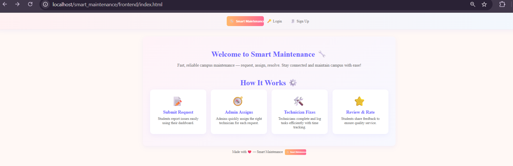
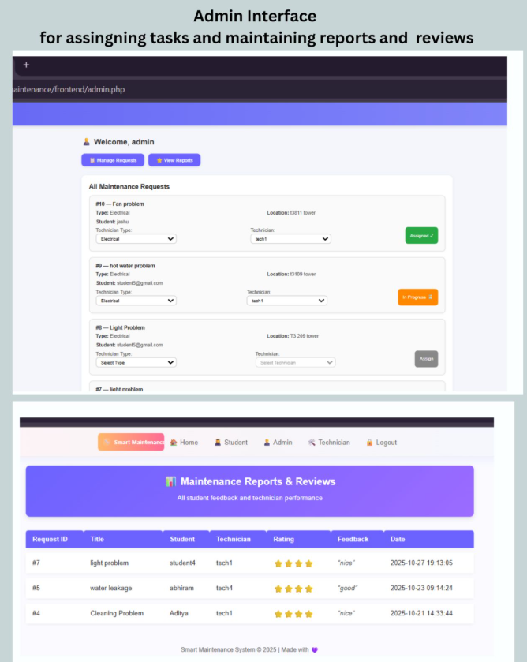

# Smart Maintenance Management System

## 🌐 Live Demo (Frontend)
👉 **View the Live Interface:**  
https://dashwanth15.github.io/smart-maintenance-system/

> This link opens a frontend demo of the project hosted on GitHub Pages.  
> The complete backend (PHP + MySQL) runs locally using XAMPP.

---

## 📌 Project Overview
Smart Maintenance Management System is a role-based full-stack web application developed to simplify and organize maintenance operations in environments such as universities, hostels, apartments, and office campuses.

The system replaces manual complaint registers and informal communication with a structured digital platform where maintenance requests can be raised, assigned, tracked, and resolved efficiently.

---

## ❓ Why This Project?
In many institutions, maintenance issues are still handled using phone calls, paper logs, or messaging apps. This often results in:
- Delayed issue resolution
- No proper tracking
- Lack of accountability
- Poor communication between users, technicians, and administrators

This project addresses these problems by providing a centralized, transparent, and role-based maintenance management system.

---

## ✨ Key Features
- Role-based login for **Student, Admin, and Technician**
- Students can raise and track maintenance requests
- Admin can view all requests and assign technicians
- Technicians can update work status and mark tasks as completed
- Time tracking for completed tasks
- Feedback and rating system after issue resolution
- Clean and user-friendly interface
- Structured database design for scalability

---

## 🧠 System Design
The application follows a standard three-layer architecture:

- **Frontend:** HTML, CSS, JavaScript  
- **Backend:** PHP  
- **Database:** MySQL  

This separation makes the system easy to maintain, extend, and deploy on full-stack hosting platforms.

---

## 🛠️ Technologies Used
- HTML, CSS, JavaScript
- PHP
- MySQL
- Apache Server (XAMPP)
- Git & GitHub

---
## 🗂️ Project Structure
smart-maintenance-system/
├── frontend/ # Role-based dashboards (demo HTML pages)
├── backend/ # PHP backend logic and APIs
├── assets/ # CSS, JavaScript, images
├── database/ # MySQL database schema
└── index.html # Project landing page (demo)

---

## 🚀 Running the Project Locally
To run the complete system with backend functionality:

1. Install **XAMPP**
2. Copy the project folder into the `htdocs` directory
3. Start **Apache** and **MySQL** from the XAMPP Control Panel
4. Import the SQL file from the `database/` folder into **phpMyAdmin**
5. Open the project in the browser:
http://localhost/your-project-folder-name

---

## 🌐 Hosting & Demo Explanation
GitHub Pages supports only static websites. Since this project uses PHP and MySQL, the backend cannot run directly on GitHub Pages.

To make the project easy to review online:
- The backend logic is fully implemented in PHP and MySQL
- The frontend dashboards are provided as **HTML demo pages**
- These demo pages closely match the real application UI and workflow

This approach allows recruiters to explore the interface easily while keeping the backend implementation intact for local execution.

---

## 🔮 Future Improvements
- Email and SMS notifications
- Cloud deployment (AWS / Render / Railway)
- REST API-based backend
- Improved mobile responsiveness
- Advanced analytics and reporting dashboard

---

## 👨‍💻 Author
**Dashwanth Madduri**  
Computer Science Engineering Student  

---

## 📸 Project Screenshots

### 🏠 Home Page

### 🔐 Login Page

### 👨‍🎓 Student Dashboard

### 🧑‍💼 Admin Dashboard

### 🛠️ Technician Dashboard

